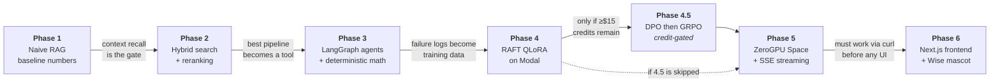
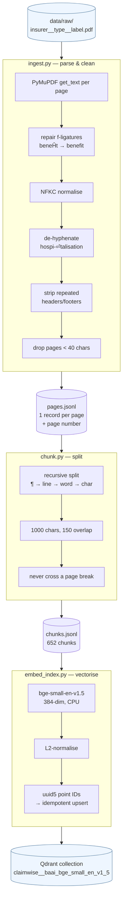
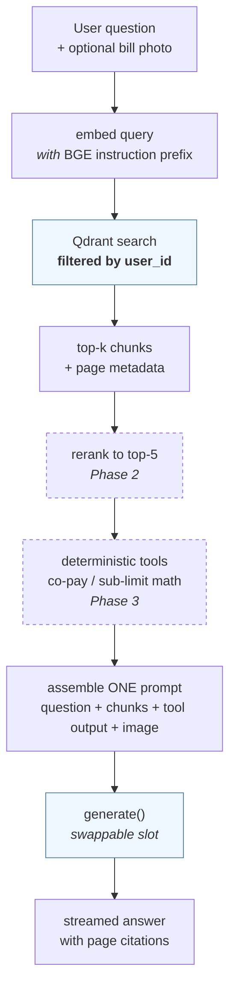

# ClaimWise — Explanation

The **what, how and why** of every component: the technical detail behind each
file and model, the measured results, and the end-to-end picture of how a PDF
becomes a cited answer.

`workflow.md` answers *"what does this file do?"* in one paragraph.
This document answers *"why is it built that way, and what did it measure?"*

> **Metrics honesty.** Every number below was computed from a real run.
> Nothing here is estimated, extrapolated, or aspirational. Values that have
> not been measured yet are marked **pending**, never guessed.

---

## 1. The whole system in one picture



The ordering is not arbitrary. **Retrieval quality caps everything**: if the
right chunk is never retrieved, no amount of fine-tuning can recover the answer,
because the model simply never sees the fact. That is why Phases 1–2 obsess over
context recall before a single GPU dollar is spent.

### The division of labour

This is the single most important idea in the project, and the one most
commonly got wrong:

| | Supplies | How it reaches the model | Changes when |
|---|---|---|---|
| **RAG** | *Knowledge* — the clauses in **your** policy | Injected into the prompt at query time | You upload a document |
| **Fine-tuning** | *Skill* — cite pages, stay grounded, refuse to guess | Baked into the weights | We retrain |

Fine-tuning never memorises policy content. If it did, every new policy would
require retraining, and the model would confidently answer from the wrong
insurer's terms.

---

## 2. Phase 1 internals — the build-time path

This runs **once per document**, on CPU, and never involves an LLM. The document
is not being *read* here; it is being made *searchable*.



**The page number is the thread that runs through all of it.** It is attached at
parse time, carried through chunking (chunks never span a page break precisely
so this stays exact), stored in the Qdrant payload, and eventually rendered as
a citation chip in the UI. In a regulated domain an answer without a verifiable
source is worthless — "you get ₹2L back" is unusable unless a human can turn to
page 34 and check.

---

## 3. Query-time path

Runs on **every question**, target 2–5 seconds. Dashed nodes are not built yet.



Two design commitments visible here:

**`user_id` filtering happens inside the search, not after it.** Retrieving the
global top-5 and then discarding other users' chunks has two failure modes: you
often end up with fewer than 5 results, and the day one code path forgets the
post-filter, a customer sees someone else's policy. Qdrant applies the filter
during index traversal, so a chunk you don't own is never scored at all. It is
wired in from day one, while there is still exactly one user, because a
boundary retrofitted later gets missed in exactly one place.

**`generate(prompt) → answer` is a swappable slot.** Phases 1–3 fill it with a
free OpenRouter model; Phase 5 swaps in the fine-tuned Qwen endpoint. Nothing
upstream changes, which is what makes the Phase 4 benchmark meaningful — the
same retrieval pipeline feeds every generator being compared, so differences are
attributable to the generator alone.

---

## 4. File-by-file — what, how, why

### `common/config.py`

**What.** Loads `config.yaml`; reads nested values by dotted key.

**How.** `yaml.safe_load` into a dict, plus `cfg_get(cfg, "ingest.extraction_mode")`
walking dot-separated segments.

**Why.** Every script's behaviour must be fully described by one versioned file,
so a metric recorded three weeks ago can be reproduced. It raises rather than
defaulting when the file is missing: a silently-defaulted config produces
numbers nobody can reproduce, which is worse than a crash.

---

### `phase1_rag/ingest.py`

**What.** PDFs → one cleaned JSON record per page.

**How.** PyMuPDF extracts text per page in one of two modes. Cleaning runs in a
fixed order — ligature repair, NFKC normalisation, de-hyphenation, boilerplate
removal, whitespace collapse — because each step can create the pattern the next
one looks for. Boilerplate detection counts lines appearing in the first or last
3 lines of ≥60% of pages, with digits masked to `#` so "Page 12 of 88" and
"Page 13 of 88" collapse to one recurring line. Document IDs are SHA-256 content
hashes truncated to 12 characters.

**Why each decision:**

- **Page-scoped records, not one big string.** Provenance is the product. A
  string loses the page number permanently and no downstream step can recover it.
- **Content-hash document IDs.** Renaming a file must not create a duplicate
  document in the vector store; re-ingesting must be idempotent.
- **Boilerplate stripping.** Policy PDFs stamp the insurer name, UIN and page
  number on every page. Left in, that text dominates the embedding of every
  short chunk, making unrelated pages look similar to one another — it actively
  destroys retrieval precision.
- **`extraction_mode` is a switch, not a hardcoded call.** Table-aware parsing
  is a *Phase 2 experiment*. Baking it in now would forfeit the ability to
  report "table-aware parsing bought us N points of context recall".
- **Filename-derived metadata.** `insurer__type__label.pdf` gives us the
  metadata Phase 2 filters on and Phase 3 compares across, with no sidecar
  manifest to keep in sync. Files that don't match still ingest, with a warning
  — one badly named file must not block a corpus.

---

### `phase1_rag/chunk.py`

**What.** Pages → overlapping, page-scoped chunks.

**How.** LangChain's `RecursiveCharacterTextSplitter` tries separators in order
— paragraph, line, word, bare character — descending only when a piece is still
over the 1,000-character budget. 150 characters of overlap. Chunk IDs are
`{doc_id}_p{page}_c{index}`.

**Why.** An embedding is a *single vector*, and a vector can only carry so much
meaning. Our pages average several thousand characters; embed a whole one and
the "waiting period for pre-existing diseases" signal is averaged together with
room rent, co-pay and AYUSH text until the page matches none of those queries
strongly. Chunking exists to keep roughly one idea per vector.

- **Why 1,000 characters.** ≈250 tokens. bge-small truncates at 512 tokens
  (~2,000 chars), so this leaves headroom — nothing is silently cut at embedding
  time. The run reports how many chunks exceed that budget; it must be zero.
- **Why 150 overlap (15%).** A clause straddling a boundary survives intact in
  one of the two neighbouring chunks. Without overlap, the sentence that
  actually answers the question can be split in half and match nothing.
- **Why chunks never cross a page break.** So every chunk inherits one exact
  page number and citations stay verifiable. The cost — a clause continuing onto
  the next page gets divided — is real, and the correct fix is Phase 2's
  parent-document retrieval, not a bigger chunk size.
- **Why recursive rather than fixed slicing.** None of Phase 2's planned
  techniques is "recursive vs fixed splitting", so using the standard splitter
  costs us no future experiment. A baseline should be what any competent team
  would start from, not a deliberately weakened strawman.

---

### `phase1_rag/embed_index.py`

**What.** Chunks → vectors → a filterable Qdrant collection.

**How.** sentence-transformers encodes chunks in batches of 32 on CPU with L2
normalisation; qdrant-client upserts them into an embedded on-disk collection
whose name encodes the embedding model. Point IDs are `uuid5(chunk_id)`.
The run ends with a filtered search against the index it just built.

**Why:**

- **Collection name encodes the model.** `claimwise__baai_bge_small_en_v1_5`.
  Two embedding models can then be indexed side by side and compared on the
  same golden questions instead of overwriting one another.
- **`uuid5` point IDs.** Qdrant requires integer or UUID IDs, and our chunk IDs
  are strings. A deterministic UUID makes re-indexing an upsert rather than a
  duplication.
- **The BGE query prefix is deliberately absent here.** BGE v1.5 models are
  trained with an instruction prefix on the *query* side only, documents bare.
  Applying it to both — or neither — measurably costs recall. It lives in
  config and is applied by `rag_chain.py`.
- **Self-verifying runs.** An index that builds cleanly but returns nothing
  useful is the most expensive kind of silent failure, because every downstream
  metric inherits it. Printing real top-3 hits with scores and page numbers
  makes that impossible to miss — and in fact this is exactly how the ligature
  defect in §7 was caught.

---

## 5. Models and libraries

### BAAI/bge-small-en-v1.5 — embedding model *(in use)*

| Property | Value |
|---|---|
| Architecture | BERT-style bi-encoder |
| Parameters | ~33M |
| Output dimensions | **384** |
| Max input | 512 tokens (~2,000 chars) |
| Similarity | Cosine, on L2-normalised vectors |
| Runs on | CPU |
| Measured throughput | **17.6 chunks/s** (batch 32, 652 chunks) |

**How it works.** A bi-encoder embeds queries and documents *independently* into
the same vector space; similarity is then a dot product. That independence is
what makes search fast — every document vector is computed once at upload time,
and a query only needs one forward pass plus a nearest-neighbour lookup. The
trade-off is that the model never sees the query and document together, so it
cannot reason about their interaction. That is precisely what a cross-encoder
reranker fixes in Phase 2, at ~100× the per-pair cost, which is why it is
applied to ~50 candidates rather than 652.

**Why this one.** It is CLAUDE.md's stated default and keeps Phase 5's on-Space
CPU ingestion fast. bge-base is ~1.5 MTEB retrieval points better for roughly 3×
the CPU time — a smaller gain than reranking should buy, so spending the budget
here first would be optimising the wrong stage. At 652 chunks a full re-index
costs about a minute, making this cheap to revisit; the A/B against bge-base is
scheduled for when the golden eval set exists and the comparison can be made on
real questions.

**The instruction prefix.** For retrieval, BGE v1.5 expects queries to be
prefixed with `"Represent this sentence for searching relevant passages: "` and
documents to be embedded bare. This asymmetry is easy to get wrong in a way that
produces no error — just quietly worse recall.

### Qdrant — vector database *(in use, embedded mode)*

Running in-process against `qdrant_storage/`, no Docker. The client API is
identical to server mode, so Phase 5's move to a hosted instance is a config
change rather than a rewrite. Single-process only, which is the one real
limitation: two terminals cannot open the store simultaneously.

**Why a vector DB at all, at only 652 chunks?** Brute-force cosine over 652
vectors would genuinely be fine. What Qdrant buys is persistence, sub-linear
search as the corpus grows, and — the decisive one — **filters applied during
index traversal**. See §3.

### Generation providers, and the economics of evaluation

RAGAS is not one LLM call per question. Faithfulness costs 1–2 calls, answer
relevancy 1, context recall 1, and **context precision costs one call per
retrieved chunk** — 5 more at top-5. With answer generation that is roughly
**9–11 calls per question**, so a 100-question golden set costs **~1,000 calls
per evaluation**. Phase 2 needs one evaluation per technique.

Measured against what's actually available:

| Source | Allowance | Full RAGAS runs it supports |
|---|---|---|
| OpenRouter free | 50 req/day (1,000/day above $10 credits) | 1 run per **3 weeks** |
| HF Pro credits | **$2 per month** (not per day) | ~2 runs per **month** |
| **NVIDIA NIM** | **~40 req/min, no daily cap** | 1 run per **25–50 min**, repeatable |

**The architectural fix matters more than the provider choice.** Retrieval
metrics need no LLM at all. If the golden set stores the ground-truth page for
each question, then `hit@5`, context recall and MRR are computed by comparing
page numbers — pure Python, zero cost, instant. Only *generation-quality*
metrics need a judge. That splits evaluation into two tiers:

| Tier | Metrics | Cost | Cadence |
|---|---|---|---|
| **Retrieval** (deterministic) | hit@5, context recall, MRR, latency | free | after every change |
| **Generation** (LLM-judged) | faithfulness, answer relevancy | ~10 calls/question | phase boundaries |

Since Phase 2 is entirely about retrieval, nearly all of its per-technique
re-evals run for free. This isn't a compromise forced by budget — it is how a
cost-aware evals team would build it regardless, because a metric that runs in
five seconds gets run, and one that costs a day doesn't.

**Role assignment:** NIM is the eval workhorse; OpenRouter free handles
development and hand-testing so it never competes with an eval run; HF Pro
credits are *not* spent on evaluation, because that subscription's real value to
this project is ZeroGPU serving in Phase 5.

**Why one class covers all three.** NIM, OpenRouter and HF Inference Providers
all expose the OpenAI chat-completions protocol. They differ only in base URL,
API key and model id — so "provider" is configuration, not a code path, and
`--provider openrouter` switches mid-eval. Phase 5 adds a fourth entry pointing
at the fine-tuned Qwen Space and the interface is unchanged, which is precisely
what makes the Phase 4 generator comparison valid.

### Planned models *(not yet in use)*

| Model | Role | Phase |
|---|---|---|
| `bge-reranker` (cross-encoder) | Rerank ~50 candidates → top 5 | 2 |
| OpenRouter free model | The `generate()` slot during development | 1–3 |
| Qwen3.5-4B | Fine-tuned generator; natively multimodal for bill/claim-form photos | 4 |
| Qwen3-4B *(fallback)* | Text-only, if LoRA tooling doesn't support the hybrid Gated DeltaNet + MoE architecture | 4 |

Framework mapping, which must not drift: **Unsloth/TRL = training only, on
Modal**. **transformers + `@spaces.GPU` + `TextIteratorStreamer` = serving, on
ZeroGPU**. **Never vLLM** — it allocates GPU at startup, which is fundamentally
incompatible with ZeroGPU's serverless attach/release model.

---

## 6. Results and benchmarking

### 6.1 Corpus

Run A was the original corpus. The Star Health file in it turned out to be a
**product brochure**, not a policy wording — 17,078 characters across 12 pages,
against 174,999 from the SBI health policy, and the document itself pointed
readers elsewhere for detail. It was replaced.

| | Run A *(brochure corpus)* | Run C *(corpus fixed + ligatures repaired)* |
|---|---:|---:|
| Documents | 4 | 4 |
| Pages kept | 67 | **102** |
| Total characters | 385,892 | **491,986** |
| Mean chars/page | 5,760 | **4,823** |

Per document, after both fixes:

| Document | Type | Pages | Chars | Chars/page |
|---|---|---:|---:|---:|
| `starhealth__health__comprehensive` | health | 47 | 122,287 | 2,602 |
| `sbigeneral__health__alpha` | health | 30 | 175,687 | 5,856 |
| `sbigeneral__home__house-insurance` | home | 17 | 100,903 | 5,935 |
| `iciciprulife__life__prusmart` | life | 8 | 93,109 | 11,639 |

Star Health went from 12 pages / 1,423 chars per page as a brochure to 47 pages
/ 2,602 as the real wording. The ICICI life document is an outlier at 11,639
chars per page — dense multi-column fine print, roughly 2,900 tokens per page.

### 6.2 Chunking — 1000 chars / 150 overlap

| Metric | Value |
|---|---:|
| Pages in | 102 |
| Chunks out | **653** |
| Chars per chunk — min / median / mean / max | 52 / 945 / 819 / 1000 |
| Chunks over the 2,000-char embedding budget | **0** |

`max = 1000` confirms the splitter honours its budget; `0` over budget confirms
nothing will be silently truncated at embedding time. Mean below median is the
expected left tail of page-end fragments.

| Document | Chunks | Pages | Mean chars |
|---|---:|---:|---:|
| `sbigeneral__health__alpha` | 230 | 30 | 813 |
| `starhealth__health__comprehensive` | 161 | 47 | 854 |
| `sbigeneral__home__house-insurance` | 134 | 17 | 828 |
| `iciciprulife__life__prusmart` | 128 | 8 | 776 |

### 6.3 Index build — bge-small-en-v1.5

| Metric | Value |
|---|---:|
| Vector dimensions | 384 |
| Chunks indexed | 653 |
| Points in store | 653 |
| Embed time | 36.68 s |
| **Throughput** | **17.8 chunks/s** |
| Upsert time | 2.22 s |

`points == chunks` confirms the deterministic IDs are not colliding.

### 6.4 First retrieval evidence

Query: *"What is the waiting period for pre-existing diseases?"*

| Rank | Score | Page | Insurer | Retrieved |
|---:|---:|---:|---|---|
| 1 | 0.8102 | 30 | starhealth | Optional Cover — Buy Back of Pre-Existing Disease Waiting Period |
| 2 | 0.7795 | 31 | starhealth | Portability, waiting period reduced by prior coverage; 36 months |
| 3 | 0.7576 | 21 | sbigeneral | Sum Insured enhancement — exclusion applies afresh; specified disease/procedures |

All three are genuinely on-topic, from both health insurers, with plausible page
numbers, at healthy cosine scores. This is the first real evidence that semantic
retrieval works on this corpus.

### 6.5 Pending

| Metric | Blocked on |
|---|---|
| Faithfulness, answer relevancy, context recall, context precision | golden eval set + `run_ragas.py` |
| hit@5 | golden eval set |
| p50 / p95 latency, tokens per query | `rag_chain.py` |
| bge-small vs bge-base retrieval quality | golden eval set |

---

## 7. Defects found and fixed

Recording these matters as much as recording metrics. Both were caught by
*inspecting real output*, not by a test suite.

### 7.1 A brochure masquerading as a policy wording

**Symptom.** Star Health yielded 17,078 characters from a 3.86 MB file — one
tenth the text of a comparable policy from a file one fifth the size.

**Cause.** The downloaded PDF was a glossy product brochure. Most of those
megabytes were images.

**Why it mattered.** Questions would have been evaluated against a document that
does not contain their answers. Context recall would have looked like a
retrieval problem when it was a corpus problem, and Phase 2 would have been
spent optimising against a hole.

**Fix.** Replaced with the real policy wording: 12 pages → 47.

### 7.2 Mis-decoded f-ligatures across an entire publisher

**Symptom.** Retrieved text read `beneĤt`, `speciĤed`, `ĥoater`, `OĦce`.

**Cause.** Both SBI PDFs embed a font subset whose f-ligature glyphs decode into
the Latin Extended-A block instead of real letters:

| Corrupt | Real | Seen as |
|---|---|---|
| `ģ` U+0123 | `ff` | staģ, oģer, suģering |
| `Ĥ` U+0124 | `fi` | beneĤt, speciĤed, qualiĤed, beneĤciary |
| `ĥ` U+0125 | `fl` | ĥoater, inĥicted, Reĥux |
| `Ħ` U+0126 | `ffi` | OĦce |

**Scope.** 47 of 102 pages — **100% of both SBI documents** (30/30 and 17/17),
**0%** of Star Health and ICICI.

**Why NFKC didn't catch it.** `Ĥ` is a legitimate Unicode character. Nothing
about the text is malformed; it is simply *wrong*. No normaliser can know that.

**Why it mattered.** The corrupted words are core insurance vocabulary —
*benefit, benefits, beneficiary, specified, defined, qualified, floater,
certified, office*. Each becomes an out-of-vocabulary token, so a chunk about
floater benefits stops matching a query about floater benefits. Worse, the
damage was **entirely one-sided**: every SBI retrieval score was depressed
relative to Star Health. Any per-insurer comparison would have been measuring
font encoding rather than retrieval quality, and the conclusion would have been
confidently wrong.

**Fix.** A character-repair map in `ingest.py`, applied before de-hyphenation.
Ingestion now also warns when any Latin Extended-A character *survives* repair,
so a publisher using an unknown mapping surfaces immediately instead of quietly
poisoning the index.

**Measured outcome.** Latin Extended-A occurrences went **47 → 0**, and 66 pages
now contain correctly spelled `benefit` / `specified` / `floater` /
`beneficiary`. The character deltas confirm the repair was surgical — it touched
the two corrupted documents and left the clean one byte-identical:

| Document | Before | After | Δ |
|---|---:|---:|---:|
| `sbigeneral__health__alpha` | 174,999 | 175,687 | +688 |
| `sbigeneral__home__house-insurance` | 100,706 | 100,903 | +197 |
| `iciciprulife__life__prusmart` | 93,109 | 93,109 | 0 |

Retrieval changed as a direct result. On the same smoke query, the third hit was
previously page 19 at score 0.7517 (reading `beneĤt`, `speciĤed`); it is now a
*different and better* chunk — page 21 at **0.7576**, with "specified" spelled
correctly. Repairing the vocabulary changed which chunk wins.

**Lesson.** The smoke query in `embed_index.py` paid for itself on its first
run. A pipeline that reports only counts and timings would have shown four
green stages and a silently damaged index.

---

### 7.3 A false refusal caused by an over-strict grounding contract

**Symptom.** *"What is the co-payment for someone who joins at age 65?"* returned
the refusal sentence, despite the corpus containing the answer.

**Investigation.** The clause exists in `starhealth__health__comprehensive.pdf`
page 39: *"co-payment of 10% of each and every claim amount ... for Insured
Persons whose age at the time of entry is 61 years and above."* Retrieval
returned page 39 at rank 3 — so the chunk **was in the model's context**.

The decisive test was rephrasing the question to echo the policy's own wording:

| Question | p.39 retrieved | Outcome |
|---|---|---|
| "co-payment for someone who joins at **age 65**?" | rank 3 | **refused** |
| "co-payment for members who enter at **61 years or above**?" | rank 2 | answered, cited `[p.39]` |

Identical context, different phrasing, opposite outcome. Retrieval was not at
fault.

**Cause.** The system prompt. Rule 4 read *"Never calculate, estimate, convert
or total anything"*, and rule 3 said to refuse *"if the passages do not contain
the answer"*. Together they led the model to conclude that "65" appearing
nowhere meant the answer was absent, and that deciding 65 ≥ 61 was forbidden
computation. This is instruction-following, not capability — Llama 3.3 70B can
compare two integers.

**Fix.** Rule 4 was written to stop the model doing co-pay arithmetic (₹2.4L ×
10%), which belongs to Phase 3's deterministic calculator. It was too broad. The
contract now separates the two: applying a stated *threshold* to the user's
situation is required, while computing *figures* remains forbidden. A new rule
states explicitly that a general rule answers a question about a specific case
under it, and refusal is narrowed to "the passages do not address the question
at all".

**Verified.** Same question, same retrieval `[1, 3, 39, 15, 20]`:

| | Before | After |
|---|---|---|
| Answer | refusal sentence | "10% of each and every claim amount [p.39]" |
| `refused` | True | **False** |
| Citation | none | `p.39`, valid |

The regression check held — the out-of-scope meteor question still refuses in 13
output tokens, so relaxing the contract did not cause over-answering.

**Why it matters.** A false refusal is a failure mode in its own right. A system
that declines when the answer is in front of it is useless in a different way
from one that fabricates — and it is *harder* to notice, because refusing looks
like caution. Phase 4's RAFT dataset must therefore train both halves: refuse
when the context is silent, **and** answer when it is not. This example is a
ready-made training case for the second half.

### 7.4 Retrieval instability across question phrasings *(open weakness, not fixed)*

**Symptom.** The same underlying question, with only the age changed, retrieves
a different chunk set — and the one clause that can answer it drops out.

| Question | Retrieved pages | Clause page 39 present? |
|---|---|---|
| "co-payment for someone who joins at **age 65**?" | 1, 3, **39**, 15, 20 | yes, rank 3 |
| "co-payment for someone who joins at **age 45**?" | 1, 3, 20, 20, 1 | **no** |

**Why it happens.** Dense retrieval embeds the whole question, so a number that
carries no semantic weight for the policy text still shifts the query vector.
Nothing anchors the search to the literal term "co-payment", which appears
verbatim in the target chunk.

**Secondary observation.** The age-45 result covers only **three distinct pages
across five slots** — two chunks from page 20 and two from page 1. Duplicate
pages consume context budget without adding information.

**Why it is not fixed here.** Both problems are precisely what Phase 2 exists to
solve, and fixing them now would forfeit the measurement:

- **Hybrid search (BM25 + dense)** would match "co-payment" lexically regardless
  of the age in the question.
- **Query rewriting** would normalise both phrasings toward the same search.
- **Diversity-aware selection** would stop one page occupying multiple slots.

Recorded here as a baseline weakness with a reproducible test case, so the
Phase 2 delta table can show the improvement rather than assert it.

### 7.5 A verified-faithful answer *(what "working" looks like)*

Question: *"What is the waiting period for pre-existing diseases?"*

> "The waiting period for pre-existing diseases is 36 months [p.31], but it can
> be reduced to 12 months if the Insured Person opts for the 'Buy Back of
> Pre-Existing Disease Waiting Period' option and pays an additional premium
> [p.30]."

Checked against the source chunk, page 30: *"reduction of waiting period in
respect of Pre-Existing Diseases from 36 months to 12 months."* Both figures are
correct, and each is attributed to the page it actually came from.

Worth stating explicitly: **citation validity and faithfulness are different
properties.** Our citation check is deterministic and free, but it only proves
the cited page was retrieved — not that the sentence attached to it is true.
Confirming the numbers required reading the chunk. That gap is exactly why
RAGAS faithfulness needs an LLM judge and cannot be computed for free.

### 7.6 A whole document silently missing from the eval set

**Symptom.** No error, no warning, no failed run. Just a summary line:

```
items written      : 100
  positives        : 85
  negatives        : 15
mean vocab overlap : 0.377
rejections         : {'vocab_leakage': 10}
by policy type     : {'health': 59, 'home': 26, '': 15}
```

Everything reads as success — 100 items, sensible overlap, filters working. But
there is no `life` key. **The ICICI life policy contributed zero questions.**

**Diagnosis, from arithmetic alone.** 59 + 26 = 85 accepted, plus 10 rejections
= **95 generation attempts**. The sampler had allocated 68 health + 34 home + 34
life = 136 candidate chunks *in that order*, and the loop stopped the instant it
held 85 accepted items — 95 attempts in, still inside the home block. It never
reached a life chunk.

**Root cause.** Oversampling was applied **per type**, but the stopping condition
was **global**:

```python
attempts = int(positives_wanted * oversample_factor)   # 136 candidates
for chunk in sampled:                                  # health, then home, then life
    if len(items) >= positives_wanted:                 # global stop at 85
        break
```

Oversampling exists to absorb rejections. When rejections are few, the surplus
from the *earlier* types satisfies the global target and every later type is
starved. The perverse consequence: **the better the generator performs, the worse
the bug gets.** With 40 rejections instead of 10 it would have reached life and
looked perfectly healthy — which is exactly why this survived the `--limit 5`
smoke test.

**Why it mattered.** Not a cosmetic imbalance. An eval set with no life questions
**cannot detect any regression in that document at all**, while presenting itself
as a complete 100-item golden set. Every subsequent metric would have been
quietly measured over three-quarters of the corpus. The intended 50/25/25 split
came out 69/31/0.

**Fix.** Three changes:

1. `allocate_targets()` splits the positive quota across types by weight using
   the largest-remainder method, so the per-type targets sum exactly.
2. `sample_chunks()` now returns candidates **grouped by policy type** instead of
   one flat list, and generation runs per type against its own accepted-item
   target. Oversampling absorbs rejections *within* a type and can no longer
   spend one type's budget on another.
3. A weighted type that produces **zero** questions is now a hard failure
   (exit 1) with an explicit message, and any shortfall logs a warning naming
   the type and the gap.

**Lesson — the one worth keeping.** This was not a crash; it was a summary that
looked like success. The single line that exposed it was `by policy type`, which
exists only because the summary reports a *distribution* rather than a total. A
run summary that prints only counts and averages cannot show you the shape of
what it produced, and shape is where this class of bug lives. It is the same
lesson as the smoke query in §7.2: **make runs report what they produced, not
just that they finished.**

---

## 8. Open decisions

| Decision | Status |
|---|---|
| Extraction mode `text` vs `blocks`/markdown | `text` now; `blocks` is a Phase 2 experiment. Column scrambling is already documented — headings arrive *after* the paragraphs they label |
| bge-small vs bge-base | small indexed; A/B deferred until the golden eval set exists |
| Eval set composition | Corpus is 2 health + 1 home + 1 life. Health-weighted split (~50/25/25) recommended; home and life will be noisy at that sample size |
| Chunk size 1000/150 | Baseline. Revisit only with eval evidence, not intuition |
